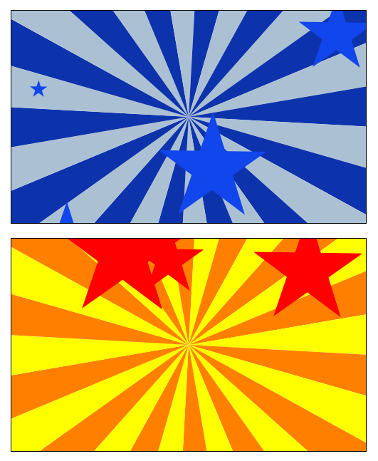

Feature Wheel Core Animation Layer
===================================

I've built this layer many times and I've seen it many times. It seemed like a good candidate for a standalone layer for use in your applications. There may be other names for this kind of effect, but I've dubbed it "feature wheel". It is normally used as a way to feature something within an app, hence the name.



Here is how you use the code. To add it to a view controller,

```
- (void)viewDidLoad
{
  [super viewDidLoad];

  MLFeatureWheelLayer *featureWheelLayer = [MLFeatureWheelLayer layer];
  [featureWheelLayer setPosition:CGPointMake([[self view] center].x, 240.0f)];
  
  [[[self view] layer] addSublayer:featureWheelLayer];

  // Create a feature wheel using different colors for the stripes
  // as well as the stars.
  MLFeatureWheelLayer *featureWheelLayer2 = [MLFeatureWheelLayer layer];
  [featureWheelLayer2 setPosition:CGPointMake([[self view] center].x, 560.0f)];
  [featureWheelLayer2 setBurstColor:[UIColor orangeColor]];
  [featureWheelLayer2 setAltBurstColor:[UIColor yellowColor]];
  [featureWheelLayer2 setStarColor:[UIColor redColor]];
  
  [[[self view] layer] addSublayer:featureWheelLayer2];
}
```

This creates two feature wheel in the same view. This is what the demo code does.

The animation will begin immediately.

The code is MIT licensed. Have fun with it. Submit pull requests if you add some cool or interesting features.

Thanks and have fun.


